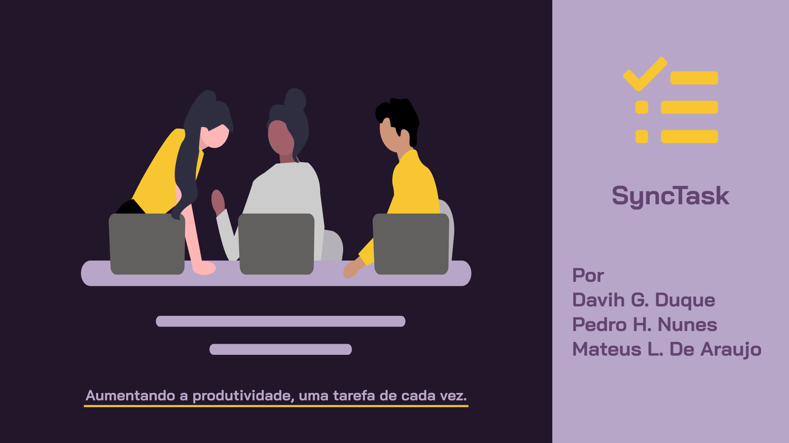

<h1 align="center">
  <a href="./public/SyncTask.pdf" target="_blank"> SyncTask </a>
</h1>

 Clique acima para ver o relatório da aplicação

 

  
  
  
   
  <a href="#-projeto">Projeto</a>&nbsp;&nbsp;&nbsp;|&nbsp;&nbsp;&nbsp;
  <a href="#-coltec">COLTEC</a>&nbsp;&nbsp;&nbsp;|&nbsp;&nbsp;&nbsp;

 

## 💻 Projeto
Objetivo:  Desenvolver um sistema utilizando conceitos de Programação Orientada a Objetos para armazenamento e leitura de informações em um banco de dados. O projeto SyncTask, uma aplicação que visa facilitar o gerenciamento de tarefas e projetos de forma sincronizada. Nosso sistema é construído com base nos princípios da Programação Orientada a Objetos e utiliza um banco de dados para armazenar e recuperar informações essenciais.

## Banco de Dados: SyncTask
Tabelas: UserTable: Armazena dados dos usuários. & TaskTable: Registra as tarefas associadas aos usuários.

Campos (UserTable): UserID, Name, Username, Password, CreatedAt, IsAdmin.

Campos (TaskTable): TaskID, UserID (chave estrangeira), Title, Description, DateEnd, Priority, CreatedAt.

## 🎓 COLTEC
Requisitos:
CRUD de dois tipos de dados.

Cadastro e login de usuários.

Listagem/relatório de algum tipo de dado.

Utilização de mecanismos de tratamento de exceção.

Implementação de classes modelo para representação dos dados.

Implementação de DAOs para comunicação com o banco de dados.

Uso de collections para manipulação de conjunto de dados.

Aplicação dos mecanismos de Herança/Polimorfismo ao longo da implementação do sistema.
